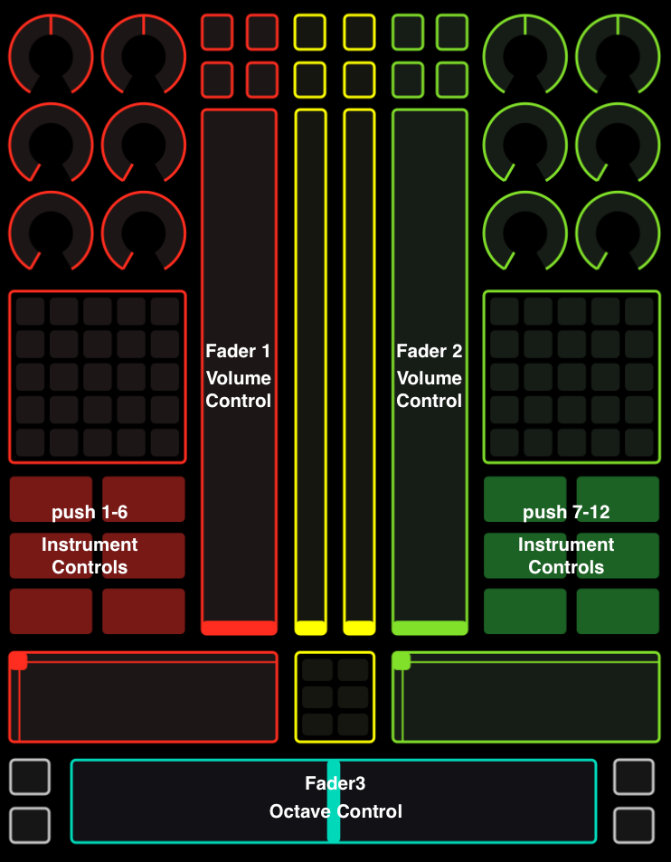

# Music Generator Based on Magenta

## How to run our code?

Firstly, Magenta and serpent is required for this system to run. 

To install Magenta, please refer to [https://github.com/tensorflow/magenta.](https://github.com/tensorflow/magenta.)

To install serpent, please refer to [Introduction to Serpent](http://www.cs.cmu.edu/~music/serpent/doc/serpent.htm)

Download the zip file and unzip it. Run:

    cd music-generator
    source activate magenta
    export SERPENTPATH=$PWD/lib:$SERPENTPATH
    wxserpent64 player/playerdemo.srp

Then the player UI should be running. Another conductor process should also be running to enable the player work correctly.

To run the conductor locally, run:

    wxserpent64 cond/conductor.srp

Choose "No" when there is window pop up.

## User Manual for TouchOSC

TouchOSC can be used to control the volume, the instrument and the range of the generated notes.

In order to use TouchOSC, the device need to be in the same network as the computer that run the player program.

Set the "Host" to the address of the computer that runs the program. Set the "Port (outgoing)" to 8001 and "Port 
(incoming)" to 9001. Choose "Mix 2 iPad" layout. Click "Done" and you are good to go!

There are 3 kinds of of controls available through TouchOSC:

- Volume Control

    We provide volume controls for both 2 melodies generated. Fader 1 and 2 each controls the volume of one melody.

- Octave Control

    The octave of the melody can be configured through Fader3 to make the melody higher or lower.

- Instrument Controls

    Though push 1-12, 12 pre-defined instruments can be selected.
   
The labeled layout is as follows:

## Design Document

The design document can be found with the source code.